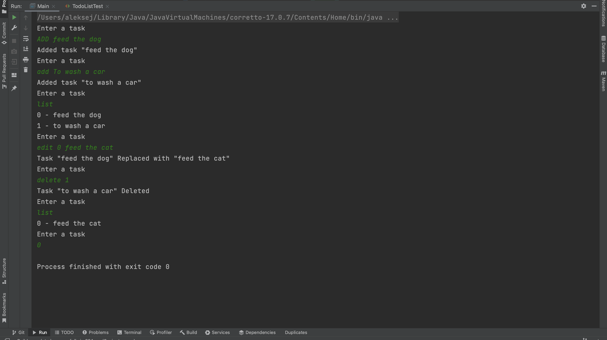

# ToDoList

Program - a to-do list that is controlled by commands in the console. Commands: LIST, ADD, EDIT, DELETE.

How commands work:

* LIST - displays cases with their serial numbers;
* ADD - adds a case to the end of the list or a case to a certain place, moving the rest of the cases forward if you specify a number; if a non-existent index is specified, add it to the end of the list.
* EDIT - replaces the case with the specified number; if a non-existent index is specified, do nothing.
* DELETE - deletes; if a non-existent index is specified, do nothing.
* 0 - stop program.
Commands are entered by the user into the console in one line.

